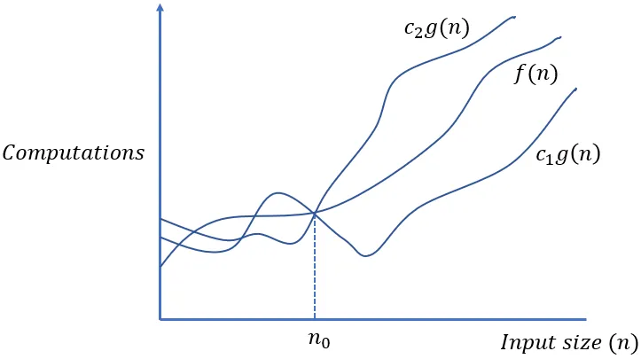

# Big Theta (Θ) Notation – Detailed Explanation

Big Theta (Θ) notation is used in asymptotic analysis to describe an algorithm’s running time in a **tight bound**—meaning it provides both an upper and lower bound for the function's growth rate.

In the analysis of algorithms, asymptotic notations are used to evaluate the performance of an algorithm by providing an exact order of growth. This article will discuss Big – Theta notations represented by a Greek letter `(Θ)`.

**Definition:** Let `g` and `f` be the function from the set of natural numbers to itself. The function `f` is said to be `Θ(g)`, if there are constants `c1`, `c2 > 0` and a natural number `n₀` such that: `c1 * g(n) ≤ f(n) ≤ c2 * g(n) for all n ≥ n₀`

Mathematical Representation:

```text
c1 * g(n) ≤ f(n) ≤ c2 * g(n) for all n ≥ n₀
```

Θ (g(n)) = {f(n): there exist positive constants `c1`, `c2` and `n₀` such that `0 ≤ c1 * g(n) ≤ f(n) ≤ c2 * g(n) for all n ≥ n₀`}
Note: `Θ(g)` is a set

The above definition means, if `f(n)` is theta of `g(n)`, then the value `f(n)` is always between `c1 * g(n) and c2 * g(n)` for large values of `n (n ≥ n₀)`. The definition of theta also requires that `f(n)` must be non-negative for values of `n` greater than `n₀`.

## **Interpretation**

- **Upper bound:** `f(n)` does not grow faster than `c2 * g(n)` after some `n₀`.
- **Lower bound:** `f(n)` does not grow slower than `c1 * g(n)` after some `n₀`.
- **Tight bound:** The function is "sandwiched" between two multiples of `g(n)`.

Graphical Representation:



In simple language, Big – Theta(Θ) notation specifies asymptotic bounds (both upper and lower) for a function `f(n)` and provides the average time complexity of an algorithm.

Follow the steps below to find the average time complexity of any program:

- Break the program into smaller segments.
- Find all types and number of inputs and calculate the number of operations they take to be executed. Make sure that the input cases are equally distributed.
- Find the sum of all the calculated values and divide the sum by the total number of inputs let say the function of `n` obtained is `g(n)` after removing all the constants, then in `Θ` notation its represented as `Θ(g(n))`

### **Big Theta Example Cases**

1. **Θ(n)**: Linear time algorithms, e.g., iterating through an array.
2. **Θ(n²)**: Quadratic time algorithms, e.g., nested loops.
3. **Θ(log n)**: Logarithmic time algorithms, e.g., binary search.
4. **Θ(1)**: Constant time operations.

---

## **Python Examples of Big Theta (Θ) Complexity**

### **Example 1: Θ(n) – Linear Complexity**

A single loop iterating over `n` elements leads to a **Θ(n)** complexity.

```python
def linear_function(arr):
    for item in arr:  # Runs n times
        print(item)    

# Example usage
arr = [1, 2, 3, 4, 5]
linear_function(arr)  # Θ(n), as it runs a single loop over n elements.
```

### **How to count runtime?**

- Let **n** be the size of `arr`.
- The `for` loop runs **once for each element** in `arr`, so the total number of iterations is **n**.
- Inside the loop, we execute:
  - `print(item)` → This is **O(1)** (constant time).
- Since this runs **n times**, the total number of operations is **Θ(n)**.

### **General Rule**

If an algorithm performs **a single pass over `n` elements**, it runs in **Θ(n)** time.

---

### **Example 2: Θ(n²) – Quadratic Complexity**

A nested loop where each iteration runs another full iteration.

```python
def quadratic_function(arr):
    n = len(arr)
    for i in range(n):          # Runs n times
        for j in range(n):      # Runs n times for each i
            print(arr[i], arr[j])

# Example usage
arr = [1, 2, 3]
quadratic_function(arr)  # Θ(n²)
```

### **How to count runtime?**

- The **outer loop** runs **n times**.
- The **inner loop** runs **n times** **for each iteration** of the outer loop.
- That means:
  - The **total number of iterations** is **n × n = n²**.
  - Inside the nested loop, `print(arr[i], arr[j])` runs in **O(1)**.
- Since we perform **n² operations**, the complexity is **Θ(n²)**.

### **General Rule**

If an algorithm has **two nested loops, each iterating `n` times**, it runs in **Θ(n²)**.

---

### **Example 3: Θ(log n) – Logarithmic Complexity**

Binary search runs in **Θ(log n)** time since the search space is halved at each step.

```python
def binary_search(arr, target):
    left, right = 0, len(arr) - 1
    while left <= right:
        mid = (left + right) // 2  # Find the middle index
        if arr[mid] == target:
            return mid  # Found, return index
        elif arr[mid] < target:
            left = mid + 1  # Search in right half
        else:
            right = mid - 1  # Search in left half
    return -1  # Not found

# Example usage
arr = [1, 3, 5, 7, 9, 11]
print(binary_search(arr, 5))  # Output: 2, Θ(log n)
```

### **How to count runtime?**

- Each iteration **halves the search space**.
- Suppose we start with `n` elements:
  1. First iteration → `n/2` elements remain.
  2. Second iteration → `n/4` elements remain.
  3. Third iteration → `n/8` elements remain.
  4. This continues until **1 element remains**.
- The number of times we can halve `n` before reaching 1 is given by: `log 2 n`
- Since each iteration takes **O(1)** operations, the total runtime is **Θ(log n)**.

### **General Rule**

If an algorithm **halves** the input size at each step, its runtime is **Θ(log n)**.

---

### **Example 4: Θ(1) – Constant Complexity**

Accessing an array index is always **Θ(1)** because it doesn't depend on `n`.

```python
def constant_function(arr, index):
    return arr[index]  # Direct access

# Example usage
arr = [10, 20, 30, 40]
print(constant_function(arr, 2))  # Output: 30, Θ(1)
```

### **How to count runtime?**

- Accessing an element in an array by index takes **O(1)** because memory is directly addressed.
- The operation `arr[index]` does not depend on `n`, and whether `n = 10` or `n = 1,000,000`, the operation **always takes the same amount of time**.
- The runtime is **Θ(1)**.

### **General Rule**

If an algorithm always takes the **same number of steps regardless of `n`**, its runtime is **Θ(1)**.

---

## **Final Summary**

| Example | Code Operation | Counted Steps | Complexity |
|---------|--------------|--------------|-------------|
| **Linear Search** | Loop over `n` elements | **n** | **Θ(n)** |
| **Nested Loops** | Two loops, `n × n` | **n²** | **Θ(n²)** |
| **Binary Search** | Halving the problem size | **log n** | **Θ(log n)** |
| **Direct Access** | Array lookup | **1** | **Θ(1)** |

---

## **Key Takeaways**

- **Θ(g(n)) gives a tight bound**, meaning it provides both the upper and lower limits for an algorithm's growth rate.
- It is useful in cases where we need a **precise classification** of an algorithm’s time complexity.
- **Different algorithms** have different growth rates, but Big Theta helps **categorize them efficiently**.
- **In Python**, understanding Big Theta helps optimize code and choose the best algorithm for a given problem.
