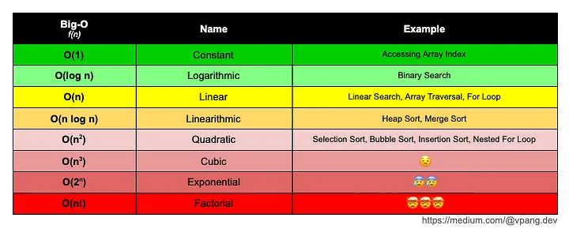

# Asymptotic Notation: Common Runtimes

Asymptotic notation is used in computer science to describe the running time (or space usage) of an algorithm as a function of the input size `n`, especially for large inputs. It helps in comparing algorithms and understanding their efficiency without worrying about constant factors or lower-order terms.  

## **Common Asymptotic Runtimes**

Before we delve into the multiple runtime cases, let’s see the different common runtimes a program could have. Below is a list of common runtimes that run from fastest to slowest.

**Θ(1)**. This is constant runtime. This is the runtime when a program will always do the same thing regardless of the input. For instance, a program that only prints “hello, world” runs in `Θ(1)` because the program will always just print “hello, world”.

**Θ(log n)**. This is logarithmic runtime. You will see this runtime in search algorithms.

**Θ(n)**. This is linear runtime. You will often see this when you have to iterate through an entire dataset.

**Θ(n*log n)**. You will see this runtime in sorting algorithms.

**Θ(n²)**. This is an example of a polynomial runtime. When `n` is raised to the 2nd power, it’s known as a quadratic runtime. You will see this runtime when you have to search through a two-dimensional dataset (like a matrix) or nested loops.

**Θ(2n)**. This is exponential runtime. You will often see this runtime in recursive algorithms (Don’t worry if you don’t know what that is yet!).

**Θ(n!)**. This is factorial runtime. You will often see this runtime when you have to generate all of the different permutations of something. For instance, a program that generates all the different ways to order the letters “abcd” would run in this runtime.




---

### **1. Constant Time: O(1)**

- **Definition:** The execution time of the algorithm does not depend on the input size.
- **Example:** Accessing an element in an array by index (`arr[i]`).
- **Graph Behavior:** The runtime remains constant as `n` increases.

**Example Code (Python):**

```python
def get_first_element(arr):
    return arr[0]  # Always takes constant time
```

---

### **2. Logarithmic Time: O(log n)**

- **Definition:** The number of operations grows logarithmically with `n`, meaning it grows slowly even for large inputs.
- **Example:** Binary search in a sorted array.
- **Graph Behavior:** The curve rises steeply at first but flattens quickly.

**Example Code (Binary Search in Python):**

```python
def binary_search(arr, target):
    left, right = 0, len(arr) - 1
    while left <= right:
        mid = (left + right) // 2
        if arr[mid] == target:
            return mid
        elif arr[mid] < target:
            left = mid + 1
        else:
            right = mid - 1
    return -1  # Not found
```

- At each step, the search space is divided by 2.
- If the array has `n` elements, it will take at most `log 2 n` steps.

---

### **3. Linear Time: O(n)**

- **Definition:** The number of operations grows directly in proportion to the input size.
- **Example:** Iterating through an array.
- **Graph Behavior:** A straight-line increase as `n` increases.

**Example Code (Linear Search in Python):**

```python
def linear_search(arr, target):
    for i in range(len(arr)):
        if arr[i] == target:
            return i
    return -1  # Not found
```

---

### **4. Linearithmic Time: O(n log n)**

- **Definition:** The runtime grows slightly faster than linear time but much slower than quadratic time.
- **Example:** Efficient sorting algorithms like Merge Sort and Quick Sort.
- **Graph Behavior:** A steep but not exponential increase.

**Example Code (Merge Sort in Python):**

```python
def merge_sort(arr):
    if len(arr) <= 1:
        return arr
    mid = len(arr) // 2
    left = merge_sort(arr[:mid])
    right = merge_sort(arr[mid:])
    return merge(left, right)

def merge(left, right):
    sorted_arr = []
    i = j = 0
    while i < len(left) and j < len(right):
        if left[i] < right[j]:
            sorted_arr.append(left[i])
            i += 1
        else:
            sorted_arr.append(right[j])
            j += 1
    sorted_arr.extend(left[i:])
    sorted_arr.extend(right[j:])
    return sorted_arr
```

- Sorting involves `n` steps, each requiring `O(log n)` merge operations.

---

### **5. Quadratic Time: O(n²)**

- **Definition:** The number of operations is proportional to `n²`, meaning if `n` doubles, the runtime increases by `4x`.
- **Example:** Bubble Sort, Selection Sort, and Insertion Sort.
- **Graph Behavior:** The curve rises sharply.

**Example Code (Bubble Sort in Python):**

```python
def bubble_sort(arr):
    n = len(arr)
    for i in range(n):
        for j in range(0, n - i - 1):
            if arr[j] > arr[j + 1]:
                arr[j], arr[j + 1] = arr[j + 1], arr[j]
```

- Nested loops contribute to `O(n²)` complexity.

---

### **6. Cubic Time: O(n³)**

- **Definition:** The runtime scales with the cube of the input size.
- **Example:** Matrix multiplication with three nested loops.
- **Graph Behavior:** The curve grows even faster than quadratic time.

**Example Code (Naive Matrix Multiplication in Python):**

```python
def matrix_multiply(A, B):
    n = len(A)
    result = [[0] * n for _ in range(n)]
    for i in range(n):
        for j in range(n):
            for k in range(n):
                result[i][j] += A[i][k] * B[k][j]
    return result
```

- Three nested loops contribute to `O(n³)` complexity.

---

### **7. Exponential Time: O(2^n)**

- **Definition:** The number of operations doubles with each additional element.
- **Example:** Recursive algorithms like the naive Fibonacci sequence calculation.
- **Graph Behavior:** The curve rises extremely fast.

**Example Code (Naive Fibonacci in Python):**

```python
def fibonacci(n):
    if n <= 1:
        return n
    return fibonacci(n - 1) + fibonacci(n - 2)
```

- This runs in `O(2^n)` because each call spawns two more recursive calls.

---

### **8. Factorial Time: O(n!)**

- **Definition:** The runtime grows as fast as the factorial of the input size.
- **Example:** Brute-force solutions to the Traveling Salesman Problem.
- **Graph Behavior:** The steepest possible increase.

**Example Code (Generating All Permutations in Python):**

```python
from itertools import permutations

def all_permutations(arr):
    return list(permutations(arr))
```

- The number of permutations of an `n-element` set is `n!`.

---

## **Summary Table**

| Complexity | Name | Example |
|------------|------|---------|
|  O(1)  | Constant | Accessing an array element |
|  O(log n)  | Logarithmic | Binary search |
|  O(n)  | Linear | Linear search |
|  O(n log n)  | Linearithmic | Merge Sort, Quick Sort |
|  O(n²)  | Quadratic | Bubble Sort, Insertion Sort |
|  O(n³)  | Cubic | Matrix multiplication |
|  O(2^n)  | Exponential | Recursive Fibonacci |
|  O(n!)  | Factorial | Traveling Salesman Problem |

---

Let’s go step by step and analyze how to count the runtime for each example in detail:

## **1. Constant Time: O(1)**  

- **Example:**

  ```python
  def get_first_element(arr):
      return arr[0]  # Always takes constant time
  ```

- **Analysis:**  
  - The function always takes a single operation regardless of the array size.
  - Accessing an element by index in an array is a direct memory lookup (takes one step).
  - No loops or recursion, so **runtime remains constant**.

📌 **Conclusion:** `O(1)` (constant time) because there is no dependency on `n`.

---

## **2. Logarithmic Time: O(log n)**  

- **Example (Binary Search):**

  ```python
  def binary_search(arr, target):
      left, right = 0, len(arr) - 1
      while left <= right:
          mid = (left + right) // 2
          if arr[mid] == target:
              return mid
          elif arr[mid] < target:
              left = mid + 1
          else:
              right = mid - 1
      return -1  # Not found
  ```

- **Analysis:**  
  - Each iteration **divides the search space by 2**.
  - If the array has `n` elements:
    - First step: `n`
    - Second step: `n/2`
    - Third step: `n/4`
    - …
    - Last step: `1` (when we find or finish searching).
  - The number of times we can divide `n` before reaching 1 is **log 2 n**.

📌 **Conclusion:** `O(log n)` (logarithmic time) because the input size is reduced exponentially in each iteration.

---

## **3. Linear Time: O(n)**  

- **Example (Linear Search):**

  ```python
  def linear_search(arr, target):
      for i in range(len(arr)):
          if arr[i] == target:
              return i
      return -1  # Not found
  ```

- **Analysis:**  
  - The function **loops through all `n` elements** in the worst case.
  - If the element is not found, we check all elements once → **n iterations**.
  - Each iteration takes a constant amount of time `O(1)`.

📌 **Conclusion:** `O(n)` (linear time) because the number of operations grows **directly proportional** to `n`.

---

## **4. Linearithmic Time: O(n log n)**  

- **Example (Merge Sort):**

  ```python
  def merge_sort(arr):
      if len(arr) <= 1:
          return arr
      mid = len(arr) // 2
      left = merge_sort(arr[:mid])
      right = merge_sort(arr[mid:])
      return merge(left, right)

  def merge(left, right):
      sorted_arr = []
      i = j = 0
      while i < len(left) and j < len(right):
          if left[i] < right[j]:
              sorted_arr.append(left[i])
              i += 1
          else:
              sorted_arr.append(right[j])
              j += 1
      sorted_arr.extend(left[i:])
      sorted_arr.extend(right[j:])
      return sorted_arr
  ```

- **Analysis:**  
  - Merge Sort divides the array into halves **(log 2 n)** times.
  - Each division requires merging, which takes **O(n)**.
  - The recurrence relation:
  
    ```text  
    T(n) = 2T(n/2) + O(n)
    ```

  - This expands to **O(n log n)**.

📌 **Conclusion:** `O(n log n)` (linearithmic time) because **logarithmic divisions** are combined with **linear merging**.

---

## **5. Quadratic Time: O(n²)**  

- **Example (Bubble Sort):**

  ```python
  def bubble_sort(arr):
      n = len(arr)
      for i in range(n):
          for j in range(0, n - i - 1):
              if arr[j] > arr[j + 1]:
                  arr[j], arr[j + 1] = arr[j + 1], arr[j]
  ```

- **Analysis:**  
  - Two **nested loops**:
    - Outer loop runs `n` times.
    - Inner loop runs at most `n` times in the worst case.
  - Total iterations:

    ```text
    (n - 1) + (n - 2) + ... + 1 = n(n-1) / 2 ≈ O(n²)
    ```

📌 **Conclusion:** `O(n²)` (quadratic time) because **every element is compared with every other element**.

---

## **6. Cubic Time: O(n³)**  

- **Example (Matrix Multiplication):**

  ```python
  def matrix_multiply(A, B):
      n = len(A)
      result = [[0] * n for _ in range(n)]
      for i in range(n):
          for j in range(n):
              for k in range(n):
                  result[i][j] += A[i][k] * B[k][j]
      return result
  ```

- **Analysis:**  
  - **Three nested loops**, each iterating `n` times.
  - Total operations:  

    ```text
    n * n * n = n³
    ```

📌 **Conclusion:** `O(n³)` (cubic time) because **three nested loops iterate over `n`**.

---

## **7. Exponential Time: O(2^n)**  

- **Example (Naive Fibonacci):**

  ```python
  def fibonacci(n):
      if n <= 1:
          return n
      return fibonacci(n - 1) + fibonacci(n - 2)
  ```

- **Analysis:**  
  - Each call to `fibonacci(n)` **calls itself twice**.
  - Forms a binary tree of recursive calls of height `n`.
  - Number of calls grows like:

    ```text
    T(n) = T(n-1) + T(n-2) ≈ 2^n
    ```

📌 **Conclusion:** `O(2^n)` (exponential time) because **the number of function calls doubles each step**.

---

## **8. Factorial Time: O(n!)**  

- **Example (Generating All Permutations):**

  ```python
  from itertools import permutations

  def all_permutations(arr):
      return list(permutations(arr))
  ```

- **Analysis:**  
  - Number of ways to arrange `n` elements:

    ```text
    n! = n * (n-1) * (n-2) * ... * 1
    ```

  - A brute-force approach generates all `n!` permutations.

📌 **Conclusion:** `O(n!)` (factorial time) because **every possible arrangement is generated**.

---

## **Final Summary**

| Complexity | Example | Why? |
|------------|---------|------|
|  O(1)  | Array access | Constant operations |
|  O(log n)  | Binary Search | Divides input each step |
|  O(n)  | Linear Search | One operation per element |
|  O(n log n)  | Merge Sort | Logarithmic splits + linear merge |
|  O(n²)  | Bubble Sort | Nested loops |
|  O(n³)  | Matrix Multiplication | Three nested loops |
|  O(2^n)  | Recursive Fibonacci | Calls double each step |
|  O(n!)  | Generating permutations | Every possible arrangement |

---

## **Final Thoughts**

- **Lower complexity is better** because it scales efficiently.
- **`O(n log n)` is typically the best for sorting**.
- **Exponential and factorial complexities are infeasible** for large `n`.
- **Big-O ignores constants**, focusing only on dominant growth rates.
