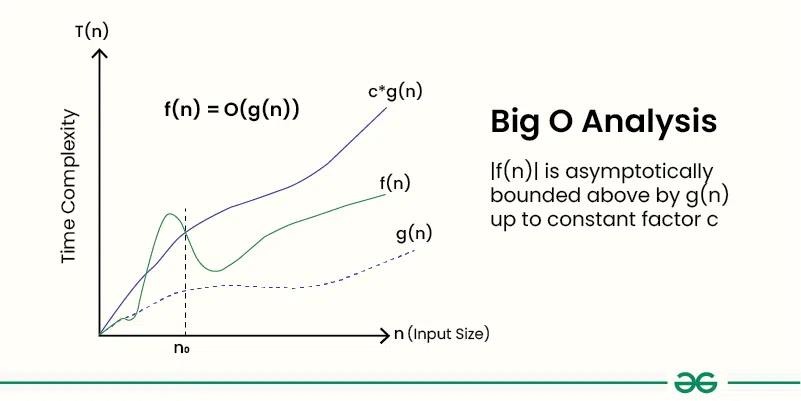

# Big O Notation: Detailed Explanation

Big O notation is a mathematical concept used in computer science to describe the performance or complexity of an algorithm. Specifically, it characterizes the time complexity (how long an algorithm takes to run) or space complexity (how much memory an algorithm uses) as a function of the input size `n`. Big O notation focuses on the `worst-case` scenario and provides an upper bound on the growth rate of an algorithm.

## Important Point

- **Big O notation** only describes the asymptotic behavior of a function, not its exact value.
- The **Big O notation** can be used to compare the efficiency of different algorithms or data structures.

Given two functions `f(n)` and `g(n)`, we say that `f(n)` is `O(g(n))` if there exist constants `c > 0` and `n₀ >= 0` such that:

```text
f(n) <= c * g(n) for all n >= n₀
```

In simpler terms, `f(n)` is `O(g(n))` if `f(n)` grows no faster than `c * g(n) for all n >= n₀` where `c` and `n₀` are constants.

**Graphic example for Big O**:



---

## Importance of Big O Notation

Big O notation is a mathematical notation used to describe the worst-case time complexity or efficiency of an algorithm or the worst-case space complexity of a data structure. It provides a way to compare the performance of different algorithms and data structures, and to predict how they will behave as the input size increases.

**Big O notation is important for several reasons:**

- Big O Notation is important because it helps analyze the efficiency of algorithms.
- It provides a way to describe how the `runtime` or `space requirements` of an algorithm grow as the input size increases.
- Allows programmers to compare different algorithms and choose the most efficient one for a specific problem.
- Helps in understanding the scalability of algorithms and predicting how they will perform as the input size grows.
- Enables developers to optimize code and improve overall performance.

---

## **Properties of Big O Notation**  

### A guide to asymptotic analysis with practical applications

Below are some important Properties of Big O Notation:

## **1. Reflexivity**  

**Statement:**  
For any function `f(n)`:

```plaintext
f(n) = O(f(n))
```

**Explanation:**  
A function always bounds itself. This is the simplest case of Big O, where `c = 1`.  

**Example:**  

- \( 2n^2 = O(n^2) \) (even with a constant multiplier).  

**Algorithm Example:**  
A loop that runs exactly \( n \) times is \( O(n) \), trivially bounded by itself.  

---

## **2. Transitivity**  

**Statement:**  
If \( f(n) = O(g(n)) \) and \( g(n) = O(h(n)) \), then  
\[
f(n) = O(h(n))
\]  

**Explanation:**  
Useful for chaining bounds (e.g., simplifying nested loops).  

**Example:**  

- \( n = O(n \log n) \) and \( n \log n = O(n^2) \) → \( n = O(n^2) \).  

**Algorithm Example:**  
A linear search (\( O(n) \)) is trivially \( O(n^2) \), but this is not tight.  

---

## **3. Constant Factor Rule**  

**Statement:**  
For any constant \( c > 0 \), if \( f(n) = O(g(n)) \), then  
\[
c \cdot f(n) = O(g(n))
\]  

**Explanation:**  
Constants are ignored in Big O.  

**Example:**  

- \( 9999n = O(n) \).  

**Algorithm Example:**  
A loop with 3 nested passes over \( n \) elements is still \( O(n) \), not \( O(3n) \).  

---

## **4. Sum Rule**  

**Statement:**  
If \( f(n) = O(g(n)) \) and \( h(n) = O(g(n)) \), then  
\[
f(n) + h(n) = O(g(n))
\]  

**Explanation:**  
The dominant term absorbs others.  

**Example:**  

- \( n^2 + n = O(n^2) \).  

**Algorithm Example:**  
Two sequential loops (each \( O(n) \)) combine to \( O(n) \), not \( O(2n) \).  

---

## **5. Product Rule**  

**Statement:**  
If \( f(n) = O(g(n)) \) and \( h(n) = O(k(n)) \), then  
\[
f(n) \cdot h(n) = O(g(n) \cdot k(n))
\]  

**Explanation:**  
Critical for analyzing nested operations.  

**Example:**  

- A loop inside another loop: \( O(n) \cdot O(n) = O(n^2) \).  

**Algorithm Example:**  
Bubble sort has nested loops over \( n \) elements → \( O(n^2) \).  

---

## **6. Composition Rule**  

**Statement:**  
If \( f(n) = O(n^k) \), then for any \( g(n) \geq 1 \),  
\[
f(g(n)) = O((g(n))^k)
\]  

**Explanation:**  
Substitutes the inner function’s growth rate into the outer one.  

**Example:**  

- If \( f(n) = n^2 \) and \( g(n) = \log n \), then \( f(g(n)) = O((\log n)^2) \).  

**Algorithm Example:**  
Binary search in a sorted list calls itself on half the input:  
\( T(n) = T(n/2) + O(1) \) → \( O(\log n) \).  

---

## **Common Pitfalls**  

1. **Misapplying Composition**:  
   - ❌ Wrong: \( 2^n = O(n) \) → \( 2^{\log n} = O(n) \) (actually \( n = O(n) \)).  
   - ✅ Right: If \( f(n) = O(2^n) \), then \( f(\log n) = O(2^{\log n}) = O(n) \).  

2. **Ignoring Dominant Terms**:  
   - ❌ \( n^3 + n^2 + n = O(n^3 + n^2) \) → Still \( O(n^3) \).  

---

## **Exercises**  

1. Simplify \( O(5n^2 + 3n \log n + 7) \).  
   **Answer:** \( O(n^2) \).  

2. If \( f(n) = O(n) \) and \( g(n) = O(n^2) \), what is \( f(n) \cdot g(n) \)?  
   **Answer:** \( O(n^3) \).  

3. A function runs in \( O(2^n) \) time. If you call it on \( \log n \)-sized inputs, what’s the new complexity?  
   **Answer:** \( O(2^{\log n}) = O(n) \).  

---

## **Real-World Implications**  

- **Optimization**: Reducing \( O(n^2) \) to \( O(n \log n) \) (e.g., sorting with MergeSort vs. BubbleSort).  
- **Scalability**: An \( O(2^n) \) algorithm fails for large \( n \), while \( O(n) \) scales linearly.  

---

## 📚 Core Properties (Cheat Sheet)

| Property        | Mathematical Form           | Example                          | Algorithm Use Case              |
|-----------------|----------------------------|----------------------------------|----------------------------------|
| **Reflexivity** | `f(n) = O(f(n))`           | `5n² = O(n²)`                   | A single loop is O(n)            |
| **Transitivity**| `f=O(g), g=O(h) ⇒ f=O(h)`  | `n=O(n log n), n log n=O(n²) ⇒ n=O(n²)` | Comparing algorithm families     |
| **Constant Factor** | `f=O(g) ⇒ c·f=O(g)`    | `999n = O(n)`                   | Ignoring loop unrolling          |
| **Sum Rule**    | `f=O(g), h=O(g) ⇒ f+h=O(g)`| `n² + n³ = O(n³)`               | Sequential operations            |
| **Product Rule**| `f=O(g), h=O(k) ⇒ f·h=O(g·k)` | `O(n) · O(log n) = O(n log n)` | Nested loops                     |
| **Composition** | `f=O(nᵏ) ⇒ f(g(n))=O(g(n)ᵏ)` | `2^(log n) = O(n)`              | Recursive algorithms             |

---

## **How Big O Works**

1. **Identify the input size `n`**:
   - Determine what `n` represents (e.g., the length of a list, the number of nodes in a graph).

2. **Count the basic operations**:
   - Count how many times the algorithm performs a basic operation (e.g., comparisons, assignments).

3. **Express the complexity**:
   - Write the complexity in terms of `n`, simplifying by dropping constants and lower-order terms.

**Here are some common Big O notations, ordered from fastest to slowest**:

1. **O(1) - Constant Time**:
   - The algorithm takes the same amount of time regardless of the input size.
   - Example: Accessing an element in an array by index.

2. **O(log n) - Logarithmic Time**:
   - The algorithm's runtime grows logarithmically with the input size.
   - Example: Binary search.

3. **O(n) - Linear Time**:
   - The algorithm's runtime grows linearly with the input size.
   - Example: Iterating through a list.

4. **O(n log n) - Linearithmic Time**:
   - The algorithm's runtime grows in proportion to `n log n`.
   - Example: Efficient sorting algorithms like Merge Sort and Quick Sort.

5. **O(n²) - Quadratic Time**:
   - The algorithm's runtime grows quadratically with the input size.
   - Example: Nested loops.

6. **O(2^n) - Exponential Time**:
   - The algorithm's runtime doubles with each additional input.
   - Example: Recursive Fibonacci without memoization.

7. **O(n!) - Factorial Time**:
   - The algorithm's runtime grows factorially with the input size.
   - Example: Generating all permutations of a list.

---

## **Key Rules of Big O**

- **Constant factors are ignored** → `O(5n²) → O(n²)`
- **Lower order terms are ignored** → `O(n² + n) → O(n²)`
- **Only the dominant term matters** → The fastest-growing term determines complexity.

## **Common Big O Complexities**

| Complexity  | Name                  | Example Algorithm     |
|------------|----------------------|----------------------|
| `O(1)`     | Constant Time         | Hash table lookup    |
| `O(log n)` | Logarithmic Time      | Binary search       |
| `O(n)`     | Linear Time           | Looping through an array |
| `O(n log n)` | Linearithmic Time  | Merge Sort, QuickSort (average case) |
| `O(n²)`    | Quadratic Time        | Bubble Sort, Insertion Sort |
| `O(2^n)`   | Exponential Time      | Recursive Fibonacci |
| `O(n!)`    | Factorial Time        | Traveling Salesman Problem |

---

## **Examples in Python**

### **(a) O(1) - Constant Time**

Regardless of input size, the function executes a fixed number of operations.

```python
def constant_time_example(arr):
    return arr[0]  # Always returns the first element
```

✅ **Efficiency:** Always executes in the same amount of time.

---

### **(b) O(log n) - Logarithmic Time**

Efficient algorithms like binary search reduce the problem size by half each step.

```python
def binary_search(arr, target):
    left, right = 0, len(arr) - 1
    while left <= right:
        mid = (left + right) // 2
        if arr[mid] == target:
            return mid
        elif arr[mid] < target:
            left = mid + 1
        else:
            right = mid - 1
    return -1  # Not found
```

✅ **Efficiency:** `O(log n)` because the search space is halved at each step.

---

### **(c) O(n) - Linear Time**

A function that iterates through all elements in an array.

```python
def linear_search(arr, target):
    for i in range(len(arr)):
        if arr[i] == target:
            return i
    return -1  # Not found
```

✅ **Efficiency:** `O(n)`, as the number of operations grows linearly with `n`.

---

### **(d) O(n log n) - Linearithmic Time**

Sorting algorithms like **Merge Sort**.

```python
def merge_sort(arr):
    if len(arr) <= 1:
        return arr
    mid = len(arr) // 2
    left = merge_sort(arr[:mid])
    right = merge_sort(arr[mid:])
    
    return merge(left, right)

def merge(left, right):
    result = []
    i = j = 0
    while i < len(left) and j < len(right):
        if left[i] < right[j]:
            result.append(left[i])
            i += 1
        else:
            result.append(right[j])
            j += 1
    result.extend(left[i:])
    result.extend(right[j:])
    return result
```

✅ **Efficiency:** `O(n log n)`, as the array is divided recursively (`log n` splits) and merged in `O(n)` time.

---

### **(e) O(n²) - Quadratic Time**

Nested loops, like **Bubble Sort**.

```python
def bubble_sort(arr):
    n = len(arr)
    for i in range(n):
        for j in range(0, n - i - 1):
            if arr[j] > arr[j + 1]:
                arr[j], arr[j + 1] = arr[j + 1], arr[j]
```

✅ **Efficiency:** `O(n²)`, because of two nested loops iterating over `n`.

---

### **(f) O(2^n) - Exponential Time**

Recursive Fibonacci.

```python
def fibonacci(n):
    if n <= 1:
        return n
    return fibonacci(n - 1) + fibonacci(n - 2)
```

✅ **Efficiency:** `O(2^n)`, as each function call branches into two.

---

## **Why Big O Matters**

- Helps compare algorithms before implementation.
- Guides optimization efforts.
- Essential for competitive programming and technical interviews.

---

## **How to Count Runtime in Detail?**

Measuring runtime is crucial for analyzing an algorithm's efficiency. This involves both theoretical (Big O notation) and empirical (actual execution time) analysis.

### **1. Theoretical Runtime Analysis**

Theoretical runtime is determined by counting the number of operations an algorithm performs as a function of input size `n`.

**Example: Counting Operations in a Loop:**

```python
def count_operations(n):
    count = 0
    for i in range(n):  # Runs n times
        count += 1  # Constant time O(1) operation
    return count
```

- **Loop runs `n` times** → `O(n)`
- **Each iteration does `O(1)` work** → Total complexity = **O(n)**

**Nested Loop Example:**

```python
def nested_loops(n):
    count = 0
    for i in range(n):  # Runs n times
        for j in range(n):  # Runs n times for each i
            count += 1
    return count
```

- **Outer loop runs `n` times**
- **Inner loop runs `n` times for each outer loop**
- **Total operations**: `n * n = n²`
- **Time complexity**: **O(n²)**

---

### **2. Empirical Runtime Analysis**

Empirical analysis measures actual execution time using Python tools like `time`, `timeit`, and `cProfile`.

#### **Method 1: Using `time` Module**

```python
import time

def measure_runtime():
    start_time = time.time()  # Record start time
    
    # Code to measure
    sum = 0
    for i in range(1000000):
        sum += i
    
    end_time = time.time()  # Record end time
    print(f"Execution Time: {end_time - start_time:.6f} seconds")

measure_runtime()
```

📌 **Pros**: Simple  
📌 **Cons**: Affected by external factors (CPU load, OS scheduling)

---

#### **Method 2: Using `timeit` Module (More Precise)**

The `timeit` module runs the function multiple times to get a reliable average.

```python
import timeit

def test_function():
    sum = 0
    for i in range(1000000):
        sum += i

# Measure execution time
execution_time = timeit.timeit(test_function, number=10)
print(f"Average Execution Time: {execution_time / 10:.6f} seconds")
```

📌 **Pros**: More accurate by reducing variability  
📌 **Cons**: Cannot directly measure large functions

---

#### **Method 3: Using `cProfile` for Detailed Profiling**

For complex programs, use `cProfile` to analyze function calls and execution time.

```python
import cProfile

def profile_test():
    sum = 0
    for i in range(1000000):
        sum += i

cProfile.run('profile_test()')
```

📌 **Pros**: Provides a breakdown of function calls  
📌 **Cons**: Overhead of profiling can slightly affect execution time

---

### **3. Counting Runtime for Recursive Functions**

Recursion can be tricky to analyze. Consider the Fibonacci function:

```python
def fibonacci(n):
    if n <= 1:
        return n
    return fibonacci(n - 1) + fibonacci(n - 2)
```

- **Each call branches into two more calls.**
- **Total number of calls is approximately `O(2^n)`.**
- **To verify, use `cProfile` or count calls manually:**

```python
count = 0
def fibonacci_count(n):
    global count
    count += 1
    if n <= 1:
        return n
    return fibonacci_count(n - 1) + fibonacci_count(n - 2)

fibonacci_count(5)
print(f"Function calls: {count}")
```

---

### **Practical Tips for Measuring Runtime**

✅ **Use `timeit` for small code snippets**  
✅ **Use `cProfile` for larger programs**  
✅ **Run multiple trials to smooth out inconsistencies**  
✅ **Check different input sizes (`n`) to estimate complexity**  

---

Let's measure runtime for various **common asymptotic runtimes** and explain their behavior in detail.

## **1. Common Asymptotic Runtimes**

Here’s a list of common time complexities we’ll analyze:

| Complexity   | Name                  | Example Algorithm          |
|--------------|-----------------------|----------------------------|
| `O(1)`       | Constant Time         | Hash lookup                |
| `O(log n)`   | Logarithmic Time      | Binary search              |
| `O(n)`       | Linear Time           | Loop iteration             |
| `O(n log n)` | Linearithmic Time     | Merge Sort                 |
| `O(n²)`      | Quadratic Time        | Nested loops (Bubble Sort) |
| `O(2^n)`     | Exponential Time      | Recursive Fibonacci        |
| `O(n!)`      | Factorial Time        | Traveling Salesman Problem |

---

## **2. Measuring Runtime for Each Complexity**

We'll use the `timeit` module to measure execution time and observe how runtime scales with increasing input size.

---

## **(A) O(1) - Constant Time**

This executes in a fixed amount of time, regardless of input size.

```python
import timeit

def constant_time_example():
    return 42  # Single operation

execution_time = timeit.timeit(constant_time_example, number=1000000)
print(f"O(1) Execution Time: {execution_time:.6f} seconds")
```

**Explanation:**

- The function does **one operation**, so it runs in `O(1)`.
- Runtime does **not depend on input size `n`**.

---

## **(B) O(log n) - Logarithmic Time (Binary Search)**

Binary search halves the search space at every step.

```python
def binary_search(arr, target):
    left, right = 0, len(arr) - 1
    while left <= right:
        mid = (left + right) // 2
        if arr[mid] == target:
            return mid
        elif arr[mid] < target:
            left = mid + 1
        else:
            right = mid - 1
    return -1

arr = list(range(1, 10**6))  # Large sorted array
execution_time = timeit.timeit(lambda: binary_search(arr, 999999), number=1000)
print(f"O(log n) Execution Time: {execution_time:.6f} seconds")
```

**Explanation:**

- **Divides array in half** each iteration (`log n` steps).
- Much **faster than `O(n)`** for large `n`.

---

## **(C) O(n) - Linear Time (Looping Through an Array)**

Looping through `n` elements takes `O(n)` time.

```python
def linear_search(arr, target):
    for i in range(len(arr)):
        if arr[i] == target:
            return i
    return -1

arr = list(range(1, 10**6))
execution_time = timeit.timeit(lambda: linear_search(arr, 999999), number=10)
print(f"O(n) Execution Time: {execution_time:.6f} seconds")
```

**Explanation:**

- Worst case: **traverses all `n` elements** before finding `target`.
- Slower than `O(log n)` for large `n`.

---

## **(D) O(n log n) - Linearithmic Time (Merge Sort)**

Merge Sort recursively splits and merges elements.

```python
def merge_sort(arr):
    if len(arr) <= 1:
        return arr
    mid = len(arr) // 2
    left = merge_sort(arr[:mid])
    right = merge_sort(arr[mid:])
    
    return merge(left, right)

def merge(left, right):
    result = []
    i = j = 0
    while i < len(left) and j < len(right):
        if left[i] < right[j]:
            result.append(left[i])
            i += 1
        else:
            result.append(right[j])
            j += 1
    result.extend(left[i:])
    result.extend(right[j:])
    return result

arr = list(range(10**4, 0, -1))  # Reverse sorted list
execution_time = timeit.timeit(lambda: merge_sort(arr), number=1)
print(f"O(n log n) Execution Time: {execution_time:.6f} seconds")
```

**Explanation:**

- **Splits array (`log n`) times**, merging takes `O(n)`.
- **Total runtime: `O(n log n)`**.

---

## **(E) O(n²) - Quadratic Time (Bubble Sort)**

Bubble Sort compares and swaps every pair.

```python
def bubble_sort(arr):
    n = len(arr)
    for i in range(n):
        for j in range(n - i - 1):
            if arr[j] > arr[j + 1]:
                arr[j], arr[j + 1] = arr[j + 1], arr[j]

arr = list(range(1000, 0, -1))  # Reverse sorted list
execution_time = timeit.timeit(lambda: bubble_sort(arr.copy()), number=1)
print(f"O(n²) Execution Time: {execution_time:.6f} seconds")
```

**Explanation:**

- **Nested loops run `O(n²)` times.**
- Becomes **very slow for large `n`**.

---

## **(F) O(2^n) - Exponential Time (Recursive Fibonacci)**

Recursive Fibonacci calls itself **twice per call**.

```python
def fibonacci(n):
    if n <= 1:
        return n
    return fibonacci(n - 1) + fibonacci(n - 2)

execution_time = timeit.timeit(lambda: fibonacci(30), number=1)
print(f"O(2^n) Execution Time: {execution_time:.6f} seconds")
```

**Explanation:**

- **Grows exponentially**, doubling calls each step.
- **Impossible to compute for large `n`**.

---

## **(G) O(n!) - Factorial Time (Traveling Salesman Brute Force)**

Factorial time grows **faster than exponential**.

```python
import itertools

def traveling_salesman(points):
    min_distance = float('inf')
    for perm in itertools.permutations(points):
        distance = sum(abs(perm[i] - perm[i+1]) for i in range(len(perm)-1))
        min_distance = min(min_distance, distance)
    return min_distance

points = list(range(10))  # 10! = 3,628,800 permutations
execution_time = timeit.timeit(lambda: traveling_salesman(points), number=1)
print(f"O(n!) Execution Time: {execution_time:.6f} seconds")
```

**Explanation:**

- **Tries all `n!` permutations**.
- **Extremely slow** for even moderate `n`.

---

### **Summary of Results**

| Complexity   | Small `n` Runtime | Large `n` Runtime | Practical?         |
|--------------|-------------------|-------------------|--------------------|
| `O(1)`       | Instant           | Instant           | ✅ Yes             |
| `O(log n)`   | Very fast         | Fast              | ✅ Yes             |
| `O(n)`       | Fast              | Slower            | ✅ Yes             |
| `O(n log n)` | Slower            | Still manageable  | ✅ Yes             |
| `O(n²)`      | Manageable        | Very slow         | ⚠️ Use cautiously  |
| `O(2^n)`     | Slow              | Impractical       | ❌ No              |
| `O(n!)`      | Very slow         | Impossible        | ❌ No              |

### **Key Takeaways**

1. **O(1), O(log n), O(n)**, and **O(n log n)** are practical.
2. **O(n²)** should be avoided for large `n`.
3. **O(2^n)** and **O(n!)** are only feasible for very small inputs.
