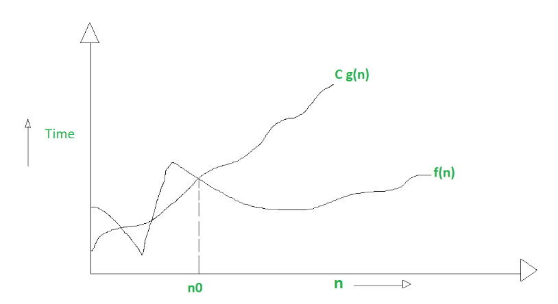

# Difference between Big O vs Big Theta Θ vs Big Omega Ω Notations

Big O, Big-Θ, and Big-Ω are used in asymptotic analysis to describe the efficiency of algorithms, but they serve different purposes. Let’s break them down in detail.

## 1. Big O notation (O)

It is defined as upper bound and upper bound on an algorithm is the most amount of time required ( the worst case performance).
Big O notation is used to describe the asymptotic upper bound.

Mathematically, if f(n) describes the running time of an algorithm; f(n) is O(g(n)) if there exist positive constant C and n0 such that,

```text
0 <= f(n) <= Cg(n) for all n >= n0
```

n = used to give upper bound a function.
If a function is O(n), it is automatically O(n-square) as well.

### **Example:**

Consider an algorithm with a time complexity of \( 3n^2 + 5n + 7 \). We can express its upper bound as:

\[
O(n^2)
\]

since, for sufficiently large \( n \), \( 3n^2 + 5n + 7 \) is at most a constant multiple of \( n^2 \).

### **Runtime Implication:**

- Provides a worst-case scenario.
- Ensures the algorithm will not exceed a particular growth rate.
- Used commonly to guarantee performance limits.

**Graphic example for Big O**:



---

## 2. Big Omega notation (Ω)

It is define as lower bound and lower bound on an algorithm is the least amount of time required ( the most efficient way possible, in other words best case).
Just like Onotation provide an asymptotic upper bound, Ωnotation provides asymptotic lower bound.

Let f(n) define running time of an algorithm;
f(n) is said to be Ω(g (n)) if there exists positive constant C and (n0) such that

```text
0 <= Cg(n) <= f(n) for all n >= n0
```

n = used to given lower bound on a function
If a function is Ω(n-square) it is automatically Ω(n) as well.

### **Example:**

For the same function \( 3n^2 + 5n + 7 \), we can express:

\[
\Omega(n^2)
\]

since for sufficiently large \( n \), it will always take at least \( n^2 \) time.

### **Runtime Implication:**

- Provides a best-case scenario.
- Used when analyzing the minimum performance guarantee.
- Often used to describe the theoretical lower limit of an algorithm's efficiency.

**Graphical example for Big Omega (Ω)**:


---

## 3. Big Theta notation (Θ)

It is define as tightest bound and tightest bound is the best of all the worst case times that the algorithm can take.

Let f(n) define running time of an algorithm.
f(n) is said to be Θ(g(n)) if f(n) is O(g(n)) and f(n) is Ω(g(n)).

Mathematically,

```text
0 <= f(n) <= C1g(n) for n >= n0
0 <= C2g(n) <= f(n) for n >= n0
```

Merging both the equation, we get :  

```text
0 <= C2g(n) <= f(n) <= C1g(n) for n >= n0
```

The equation simply means there exist positive constants C1 and C2 such that f(n) is sandwich between C2 g(n) and C1g(n).

### **Example:**

For the same function \( 3n^2 + 5n + 7 \), we can express:

\[
\Theta(n^2)
\]

because it is both **bounded above and below** by \( n^2 \) for sufficiently large \( n \).

### **Runtime Implication:**

- Represents the exact asymptotic growth.
- Used when an algorithm has a known, stable growth rate.
- More precise than Big O since it provides a two-sided bound.

**Graphic example of Big Theta (Θ)**:


---

## **Key Differences Between Big O, Big-Θ, and Big-Ω**

| Notation | Definition | Bounds | Scenario | Example |
|----------|-----------|--------|----------|---------|
| **Big O (O)** | Upper bound | Worst-case | Guarantees max runtime | \( O(n^2) \) for \( 3n^2 + 5n + 7 \) |
| **Big-Θ (Θ)** | Tight bound | Both worst and best case | Exact growth rate | \( \Theta(n^2) \) for \( 3n^2 + 5n + 7 \) |
| **Big-Ω (Ω)** | Lower bound | Best-case | Guarantees minimum runtime | \( \Omega(n^2) \) for \( 3n^2 + 5n + 7 \) |

---

## **Graphical Representation**

If we plot the functions on a graph, Big O represents an upper bound (worst case), Big-Theta represents a tight bound (average case), and Big-Ω represents a lower bound (best case).

- **Big O**: The function does not exceed a particular growth rate.
- **Big-Theta**: The function is sandwiched between two bounds.
- **Big-Ω**: The function takes at least a certain amount of time.

---

## **Real-World Example: Sorting Algorithms**

Let’s take **Merge Sort** as an example:

- **Worst Case Complexity (Big O)**: \( O(n \log n) \) → It will never exceed this time.
- **Average Case Complexity (Big-Θ)**: \( \Theta(n \log n) \) → It always runs in this time.
- **Best Case Complexity (Big-Ω)**: \( \Omega(n \log n) \) → It will take at least this much time.

For **Bubble Sort**:

- **Worst Case Complexity**: \( O(n^2) \) (if array is reverse sorted).
- **Average Case Complexity**: \( \Theta(n^2) \).
- **Best Case Complexity**: \( \Omega(n) \) (if array is already sorted).

---

## **Conclusion**

- **Big O** gives an **upper bound** (worst case).
- **Big-Θ** provides a **tight bound** (average case).
- **Big-Ω** gives a **lower bound** (best case).

Each notation is useful depending on whether we need worst-case guarantees, expected behavior, or best-case performance. Understanding these distinctions is key to analyzing algorithm efficiency! 🚀
