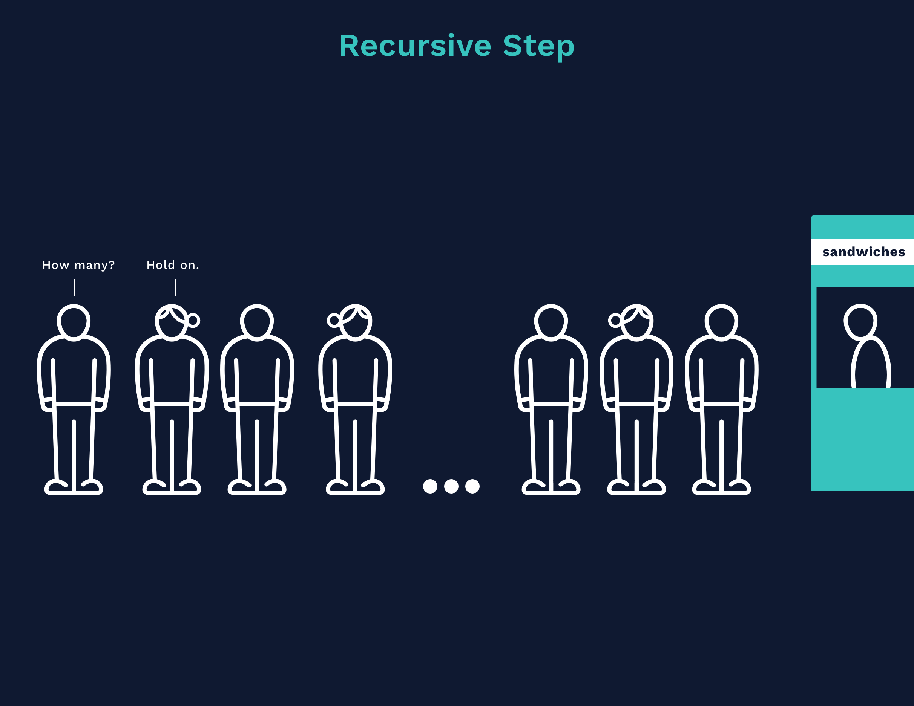

# **Recursion in Computer Science**

Recursion is a technique in computer science where a function calls itself in order to solve a larger problem by breaking it down into smaller, similar subproblems. Each recursive function must have:

1. **Base Case**: The condition that stops the recursion.
2. **Recursive Case**: The part of the function where it calls itself.

---

## **How Recursion Works**

When a function calls itself, it creates a **new function call** on the call stack. Each function call has its **own execution context** (its own local variables and parameters). The recursion continues until it reaches the **base case**, at which point it starts returning values back up the call stack.



---

### **Example 1: Factorial Calculation**

The factorial of a number `n` (denoted as `n!`) is:

```plaintext
n! = n * (n-1) * (n-2) * ... * 1
```

#### **Recursive Implementation**

```python
def factorial(n):
    if n == 0 or n == 1:  # Base case
        return 1
    return n * factorial(n - 1)  # Recursive case

print(factorial(5))  # Output: 120
```

**How It Works:**

1. `factorial(5)` → Calls `factorial(4)`, waiting for the result.
2. `factorial(4)` → Calls `factorial(3)`, waiting for the result.
3. `factorial(3)` → Calls `factorial(2)`, waiting for the result.
4. `factorial(2)` → Calls `factorial(1)`, waiting for the result.
5. `factorial(1)` → Hits the **base case** and returns `1`.
6. Now, the functions **return back up**:
   - `factorial(2) = 2 * 1 = 2`
   - `factorial(3) = 3 * 2 = 6`
   - `factorial(4) = 4 * 6 = 24`
   - `factorial(5) = 5 * 24 = 120`

---

### **Example 2: Fibonacci Series**

The Fibonacci sequence is defined as:

```plaintext
F(n) = F(n-1) + F(n-2)
```

Where:

- `F(0) = 0`
- `F(1) = 1`

**Recursive Implementation:**

```python
def fibonacci(n):
    if n == 0:  # Base case
        return 0
    elif n == 1:  # Base case
        return 1
    return fibonacci(n - 1) + fibonacci(n - 2)  # Recursive case

print(fibonacci(6))  # Output: 8
```

**How It Works:**

1. `fibonacci(6)` calls `fibonacci(5)` and `fibonacci(4)`.
2. `fibonacci(5)` calls `fibonacci(4)` and `fibonacci(3)`.
3. This process continues until the base cases are reached (`fibonacci(0)` and `fibonacci(1)`).
4. The results are then summed up to get the final result.

> **Issue:** This implementation is inefficient due to **overlapping subproblems** (it calculates `fibonacci(4)` multiple times). We can optimize it using **memoization** (storing results).

---

### **Example 3: Recursively Reverse a String**

```python
def reverse_string(s):
    if len(s) == 0:  # Base case
        return s
    return reverse_string(s[1:]) + s[0]  # Recursive case

print(reverse_string("hello"))  # Output: "olleh"
```

**How It Works:**

1. `reverse_string("hello")` calls `reverse_string("ello") + "h"`.
2. `reverse_string("ello")` calls `reverse_string("llo") + "e"`.
3. This continues until the base case (`""`).
4. The characters are concatenated in **reverse order**.

---

### **Example 4: Recursively Traverse a Directory**

A common use of recursion is traversing a file system.

```python
import os

def list_files(directory):
    for item in os.listdir(directory):
        full_path = os.path.join(directory, item)
        if os.path.isdir(full_path):  # If it's a folder, recurse into it
            list_files(full_path)
        else:
            print(full_path)  # If it's a file, print it

# Call the function on a directory
list_files("/path/to/directory")
```

This recursively **explores** subdirectories and prints file paths.

---

## **Recursion vs. Iteration**

| Feature             | Recursion                                       | Iteration         |
|---------------------|-------------------------------------------------|-------------------|
| Uses function calls | Yes                                             | No                |
| Memory usage        | High (call stack)                               | Low               |
| Performance         | Can be slow (without optimization)              | Usually faster    |
| Readability         | More intuitive for problems like tree traversal | Simpler for loops |

---

## **Optimizing Recursion**

1. **Memoization (Caching Results)**
   - Used to **avoid redundant calculations** in Fibonacci and other problems.

   ```python
   from functools import lru_cache

   @lru_cache(None)  # Automatically caches results
   def fibonacci(n):
       if n < 2:
           return n
       return fibonacci(n - 1) + fibonacci(n - 2)

   print(fibonacci(50))  # Fast due to caching
   ```

2. **Tail Recursion (Optimization in Some Languages)**
   - Python does not optimize tail recursion, but some languages (like Scheme) do.

---

### **Conclusion**

Recursion is a powerful technique that simplifies problems by breaking them down into smaller instances of the same problem. However, it can lead to high memory usage if not optimized. For efficiency, **memoization** and **iterative alternatives** are often used.
