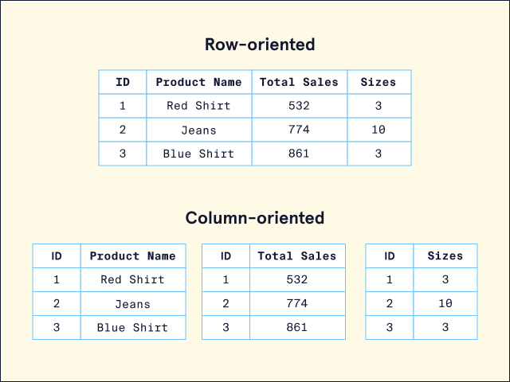

# Introduction to NoSQL

Learn about NoSQL and the different types of NoSQL databases.

## 🔷 What is NoSQL?

In the world of databases, there are many different ways to organize and store data. At this point, we are familiar with the concept of relational databases that store data in rows, form relationships between the tables, and query the data using SQL. However, a new type of database, NoSQL, started to rise in popularity in the early 21st century.

**NoSQL** stands for "**Not Only SQL**". It refers to a variety of database systems that are **non-relational**, meaning they do **not use the traditional table-based** structure of relational databases like MySQL or PostgreSQL.
Any database technology that stores data differently from relational databases can be categorized as a NoSQL database.

Instead, NoSQL databases are designed to handle:

- Large volumes of **unstructured or semi-structured data**
- **Horizontal scalability**
- High **read/write throughput**
- Flexibility in **schema design**

---

## Arriving at NoSQL

The need to store and organize data records dates back to way before the term “database” was coined. It wasn’t until around the late 1960s (although there were [methods of data storage](https://en.wikipedia.org/wiki/Punched_card) long before then) that the first implementation of a computerized database came into existence. Relational databases gained popularity in the 1970s and have remained a staple in the database world ever since. However, as datasets became exponentially larger and more complex, developers began to seek a flexible and more scalable database solution. This is where NoSQL came in. Let’s examine some of the notable reasons developers may choose a NoSQL database.

---

## Is NoSQL the Right Option?

When considering what database suits an application’s needs, it’s important to note that relational and non-relational (NoSQL) databases each offer distinct advantages and disadvantages. While not an exhaustive list, here are some notable benefits that a NoSQL database may provide:

- **Scalability**: NoSQL was designed with scalability as a priority. NoSQL can be an excellent choice for massive datasets that need to be distributed across multiple servers and locations.
- **Flexibility**: Unlike a relational database, NoSQL databases don’t require a schema. This means that NoSQL can handle unstructured or semi-structured data in different formats.
- **Developer Experience**: NoSQL requires less organization and thus lets developers focus more on using the data than on figuring out how to store it.

While these are important benefits, NoSQL databases do have some drawbacks:

- **Data Integrity**: Relational databases are typically [ACID](https://en.wikipedia.org/wiki/ACID) compliant, ensuring high data integrity. NoSQL databases follow BASE principles (basic availability, soft state, and eventual consistency) and can often sacrifice integrity for increased data distribution and availability. However, some NoSQL databases do offer ACID compliance.
- **Language Standardization**: While some NoSQL databases do use the Structured Query Language (SQL), typically, each database uses its unique language to set up, manage, and query data.

Now that we have a better idea about why we may choose or not choose a NoSQL solution, let’s explore our choices for data organization by exploring a few different types of NoSQL databases.

---

## 🔷 Why NoSQL?

- Flexible schema design (can store different structures in the same collection/table)
- High scalability for big data and real-time web apps
- Optimized for **specific types of access patterns** (e.g., document lookup, key-value access)

---

## 🔷 Types of NoSQL Databases

| Type             | Data Model                    -| Example DBs            | Use Cases                        |
|------------------|--------------------------------|------------------------|----------------------------------|
| Document Store   | JSON-like documents            | MongoDB, CouchDB       | CMS, catalogs, user profiles     |
| Key-Value Store  | Key → Value                    | Redis, DynamoDB        | Caching, session management      |
| Column Store     | Column families                | Cassandra, HBase       | Analytics, time-series data      |
| Graph Store      | Nodes + Edges (graph model)    | Neo4j, ArangoDB        | Social networks, recommendation  |

There are four common types of NoSQL databases that store data in slightly different ways. Each type will provide distinct advantages and disadvantages depending on the dataset. In the examples below, we will be using an e-commerce website to illustrate how each database may store the data.

---

## 🔷 1. Document-Based NoSQL (e.g., MongoDB)

### 🔹 Structure

Data is stored in **collections** (similar to tables), and each entry is a **document** (like a JSON object).
A document-based (also called document-oriented) database consists of data stored in hierarchical structures. Some supported document formats include JSON, BSON, XML, and YAML. The document-based model is considered an extension of the key-value database and provides querying capabilities not solely based on unique keys. Documents are considered very flexible and can evolve to fit an application’s needs. They can even model relationships!

### 📦 Example Document (in MongoDB)

```json
{
  "_id": "001",
  "name": "Alice",
  "email": "alice@example.com",
  "skills": ["Python", "MongoDB"],
  "address": {
    "city": "New York",
    "zip": "10001"
  }
}
```

- Fields can be nested.
- Each document can have a **different structure**.

### ✅ Use Case

User profiles in a social app. Each user might have different preferences or optional fields.

### 🔍 Query Example

```js
db.users.find({ "address.city": "New York" })
```

[MongoDB](https://www.mongodb.com/) is a popular option for developers looking to work with a document database.

---

## 🔷 2. Key-Value Store (e.g., Redis)

### 🔹 Structure

A key-value database consists of individual records organized via key-value pairs. In this model, keys and values can be any type of data, ranging from numbers to complex objects. However, keys must be unique. This means this type of database is best when data is attributed to a unique key, like an ID number. Ideally, the data is also simple, and we are looking to prioritize fast queries over fancy features.

- Every record is a **key** and its associated **value**.
- Very fast for simple **get/set** operations.

### 🧠 Example

```bash
SET user:001 "Alice"
GET user:001
```

Can also store:

- Strings
- Hashes (like dictionaries)
- Lists, Sets, Sorted Sets

### ✅ Use Case

- **Session management**
- **Caching** frequently accessed data

### 🔍 Example

```bash
HSET user:001 name "Alice" email "alice@example.com"
HGETALL user:001
```

Amazon [DynamoDB](https://aws.amazon.com/ru/dynamodb/) and [Redis](https://redis.io/) are popular options for developers looking to work with key-value databases.

---

## 🔷 3. Column Store (e.g., Apache Cassandra)

### 🔹 Structure

A column-oriented NoSQL database stores data similar to a relational database. However, instead of storing data as rows, it is stored as columns. Column-oriented databases aim to provide faster read speeds by being able to quickly aggregate data for a specific column. For example, take a look at the following e-commerce database of products:



- Data stored by **column** instead of rows.
- Optimized for **large-scale read/write**.

### 🧱 Example (Conceptual)

```plaintext
Row Key: 001
------------------------------------
| Name    | Email             | Age |
| Alice   | alice@example.com | 25  |
```

Each column family stores data grouped by **column** instead of traditional rows.

### ✅ Use Case

- **Time-series data**
- **Logging**
- **Real-time analytics**

### 🔍 Example

Query to get all users with age > 20 (CQL - Cassandra Query Language):

```sql
SELECT * FROM users WHERE age > 20;
```

---

## 🔷 4. Graph Database (e.g., Neo4j)

### 🔹 Structure

- Nodes: Entities (e.g., Person)
- Edges: Relationships (e.g., FRIENDS_WITH)
- Properties: Additional info on nodes or edges

### 🌐 Example

```
(Alice)-[FRIENDS_WITH]->(Bob)
```

### ✅ Use Case

- **Social networks**
- **Fraud detection**
- **Recommendation systems**

### 🔍 Query Example (Cypher - Neo4j)

```cypher
MATCH (a:Person)-[:FRIENDS_WITH]->(b:Person)
WHERE a.name = "Alice"
RETURN b.name
```

---

## 🔷 How NoSQL Works Behind the Scenes

1. **Flexible Schema**: Unlike relational DBs, NoSQL allows you to change data structure dynamically.
2. **Sharding**: Data is split into different servers to scale horizontally.
3. **Replication**: Data is copied across multiple nodes to provide fault tolerance.
4. **Eventually Consistent**: Many NoSQL systems prioritize **availability** and **partition tolerance** (as per the CAP theorem), even if **consistency** is eventual.
5. **High Throughput**: Designed for read-heavy or write-heavy workloads.

---

## 🔷 When to Use NoSQL?

✅ Consider NoSQL if:

- You need **flexible schema** (e.g., user-generated content)
- Your data volume is huge and growing fast
- You need **high availability** and **scalability**
- You don’t require complex joins or transactions

❌ Avoid NoSQL if:

- You need **ACID transactions** across many rows/tables
- You have complex **relational data** with many joins

---

## 🔷 Summary Table

| Feature          | RDBMS (SQL)        | NoSQL                      |
|------------------|-------------------|----------------------------|
| Schema           | Fixed             | Dynamic                    |
| Joins            | Supported         | Not typically supported    |
| Transactions     | Strong (ACID)     | Eventual / Limited         |
| Scalability      | Vertical          | Horizontal                 |
| Examples         | MySQL, PostgreSQL | MongoDB, Redis, Cassandra  |

---

Would you like code examples in a specific language (like Python with MongoDB/Redis), or a real-world use case implemented step-by-step?
